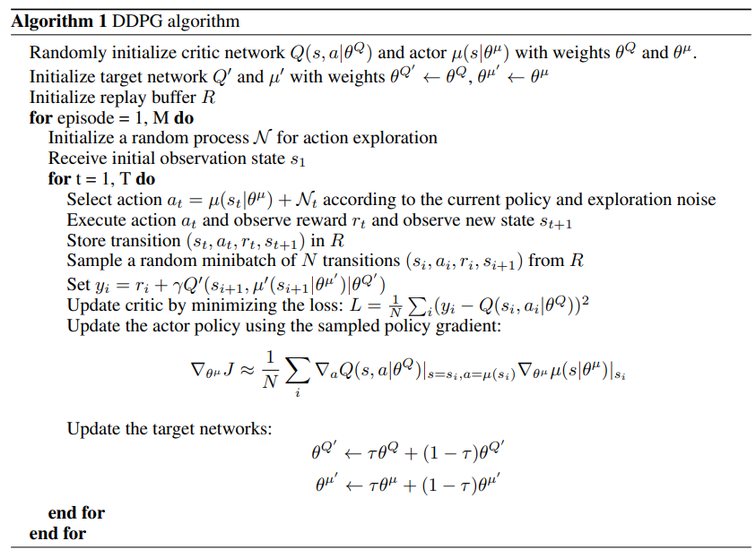
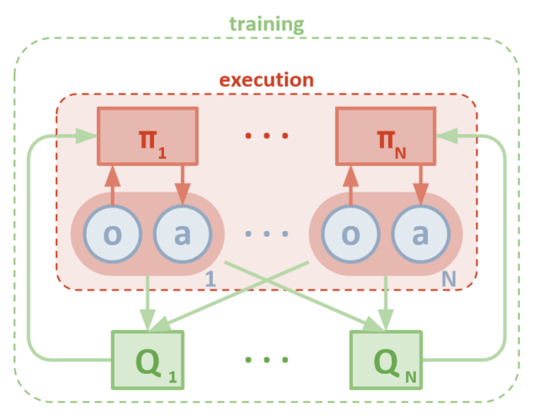
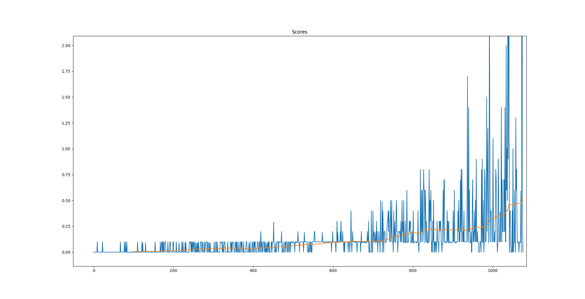

# Code Structure

At the root level we find the markdown files readme and report that will help you to understand how the project works.
The Unity folder contains the windows version of the unity Tennis env. It wouldn't be necessary in the repo it can be downloaded separately but this way is quicker. Like some "portable" version. Add here the specific version for your S.O if you aren't using Windows.

we can also find some assets for the readme.

The root level also contains all the python files to code the agent and the rest of the required logic.

    - model.py contains the Torch implementation of the neural networks that are being used in the project.

    - cli.py has a bit of code to provide the command line interface argument "--train" this way we can set dynamic logic based on terminal's input

    - config.py Is basically a wrapper class for the hyperparameters so it doesn't make other files bigger and keeps our code clean.

    - agent.py Contains the core of the project, where we use the previously defined torch models to learn from the experiences. The code is quite similar to the ddpg exercices of the course but logically adapted for this problem.
    
    - maddpg_agent.py Wraps both ddpg agents and controls the learning flow. It also contains helpers to save/load the models.
    
    - replay_buffer.py It contains the memory experience replay isolated just to be cleaner.

    - main.py puts togheter all the pieces to build and train the agent. It has two flows according with the CLI modes (train/test)
    
# Learning Algorithm
    
    It uses the MADDPG algorithm with shared replay buffer and fixed Q Targets for actor and critic networks as the algo requires.
    Which is at is core to run several DDPG agents in this case 2 (one per racket)

    Ornstein–Uhlenbeck process is used as a noise generator combined with 
    a linear epsilon greedy exploration/exploitation as the way to explore the state space.
    
   **Highlevel pseudo-code of the algorithm**
   Init random weights for critic and actor.
   Clone weights to generate target critic and target actor.
   Init replay memory
    foreach episode
        Initialize a random process for action exploration (OU noise in this case)
        Get initial state

        for each step in episode:

            Choose an action using epsilon-greedy policy and exploration noise

            Take action and observe the reward and get next state

            Store the experience tuple in the replay buffer
            
            if we have enough experiences:

                Get a minibatch of tuples 

                Compute Q targets for current states (y_i) according to paper formula
                Compute expected Q (Q_expected) with critic_local
                Update critic (QNetwork) minimizing L2_loss(y_i, Q_expected)
                ( critic_loss = F.mse_loss(Q_expected, Q_targets) )
                update actor policy using policy gradient
                Every C steps update Qtarget weights using Qvalues and tau for the soft-update

   **Formal algo with Math equations**

In MADDPG the training is a bit different by doing centralized training and decentralized execution.

The agents share the reply buffer and the their critics train seeing all agents data but each agent acts according to its own observation.

[madpg paper](https://arxiv.org/abs/1706.02275)

                
   **Hyperparameters**

        BUFFER_SIZE = int(2e4)  # replay buffer size
        BATCH_SIZE = 256        # minibatch size
        GAMMA = 0.995           # discount factor
        TAU = 1e-3              # for soft update of target parameters
        LR_ACTOR = 1e-3         # learning rate of the actor
        LR_CRITIC = 1e-3        # learning rate of the critic
        LEARN_TIMES = 4         # learn several times from a tuple
        UPDATE_EVERY = 2        #skip some learning steps

        Noise params
        ou_mu = 0.0  
        ou_theta = 0.15  
        ou_sigma = 0.20  
        EPS_START = 1.0        # Initial epsilon value (explore) 
        EPS_END = 0.1          # Last epsilon value  (exploit)
        EXP_STEPS = 3e4
        LIN_EPS_DECAY = EPS_START/EXP_STEPS  
    
   **Neural Networks**

    We have actor network, critic network and their target clones per agent.
     
    The architecture is quite simple, multi-layer perceptron. Input layer matches the state size then we have several hidden fully connected layers and finaly the output layer.
    
    Critics:
        state_size * 256 * 128 * 64 --> output 1 value (The Q value of the action,state pair)
        
    Actors:
        state_size * 128 * 64 * 32 * 16 --> output action_size values (the action to perform according to policy)

   Each network has Batch normalization in the first fully connected layer to improve the learning process and has the implementation details mention in paper and course regarding weight initialization and action concatenation.
   

# Plot of Rewards

The environment gets solved around 1080 episodes with the specified Hyperparameters as the plot reflects. 

# Ideas for Future Work

To improve the agent's performance we could do hyperparameter optimization using some framework like Optuna to make the model converge faster or even collect better experiences for its learning process. We can think about searching for a better value of each of the config.py values or also tune the neural networks. More layers, More units.

We can also use DQN related improvements like prioritized experienced replay.

We could try to play with transfer learning. Trying to copy the the best agent behaviour to the weakest following some update rules. It may speed up or stabilize training.

Try to add some punishment for very energetic moves to enforce the agents to behave smother and in a more elegant way.